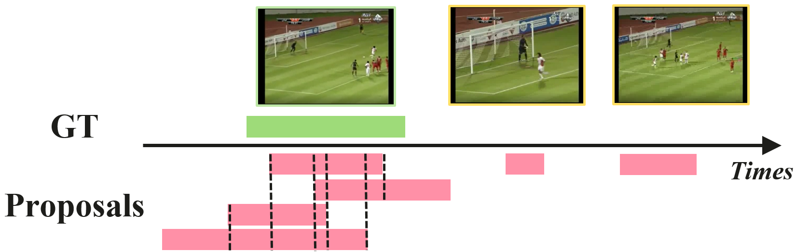

# FuSTAL for WSTAL #
[【arXiv】Full-Stage Pseudo Label Quality Enhancement for Weakly-supervised Temporal Action Localization](https://arxiv.org/abs/2407.08971)  
Qianhan Feng, Wenshuo Li, Tong Lin, Xinghao Chen*

## Abstract ##
Weakly-supervised Temporal Action Localization (WSTAL) aims to localize actions in untrimmed videos using only video-level supervision. Latest WSTAL methods introduce pseudo label learning framework to bridge the gap between classification-based training and inferencing targets at localization, and achieve cutting-edge results. In these frameworks, a classification-based model is used to generate pseudo labels for a regression-based student model to learn from. However, the quality of pseudo labels in the framework, which is a key factor to the final result, is not carefully studied. In this paper, we propose a set of simple yet efficient pseudo label quality enhancement mechanisms to build our FuSTAL framework. FuSTAL enhances pseudo label quality at three stages: cross-video contrastive learning at proposal Generation-Stage, prior-based filtering at proposal Selection-Stage and EMA-based distillation at Training-Stage. These designs enhance pseudo label quality at different stages in the framework, and help produce more informative, less false and smoother action proposals. With the help of these comprehensive designs at all stages, FuSTAL achieves an average mAP of 50.8% on THUMOS’14, outperforming the previous best method by 1.2%, and becomes the first method to reach the milestone of 50%.  

## Main Design ##

### Cross-Video Contrastive Learning for Pseudo Label Generation ###  
To excavate clearer borders for downstream regression-based student model, we introduce a cross-video contrastive learning. Unlike DCC, our cross-video contrastive learning focuses more on the border feature and conducts contrast within mini-batch, which does not need large memory bank. The training time of cross-video generator is 0.6 hours, much faster than DCC.  

### Prior-based Pseudo Label Filtering ###  
The most widely used filtering method is by confidence thresholding. However, the confidence score is not reliable under the setting of weakly-supervised learning. We examine the characteristic of classification-based model, and find that it tends to produce denser proposals around ground-truth actions along the temporal dimension. Based on this, we design an IoU score that computes the overlapping degree of each proposals and filter out those who overlap less with other proposals.  
  

### EMA-distillation ###  
After training with classification-based teacher, we try to find a more accurate pseudo label source for student, and we turn to the EMA model of student. By using EMA model as a teacher, student model enjoys its final promotion.  

## Environment Preperation ## 
Make sure python>=3.7 is installed.  
Then install required packages by running:    
``pip3 install -r requirements.txt``

## Data Preperation ##
For THUMOS'14, we make use of both non-overlapping data as well as the overlapping version.  
Download non-overlapping features from [Google Drive](https://drive.google.com/file/d/1paAv3FsqHtNsDO6M78mj7J3WqVf_CgSG/view?usp=sharing). Then put the data under ``CrossVideo-Generator/data/``.  

For student's feature, we follow TriDet to adopt the feature from [Actionformer repository](https://github.com/happyharrycn/actionformer_release). Please download the data and put them into ``Student-Training/data/`` folder.

## Run the Code ##
For training, we provide an easy way to run all stages:    
``python main.py``
 